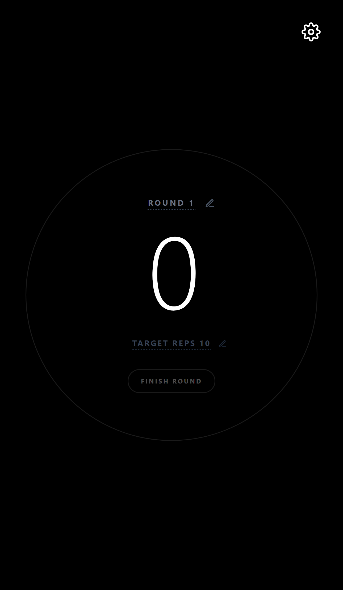
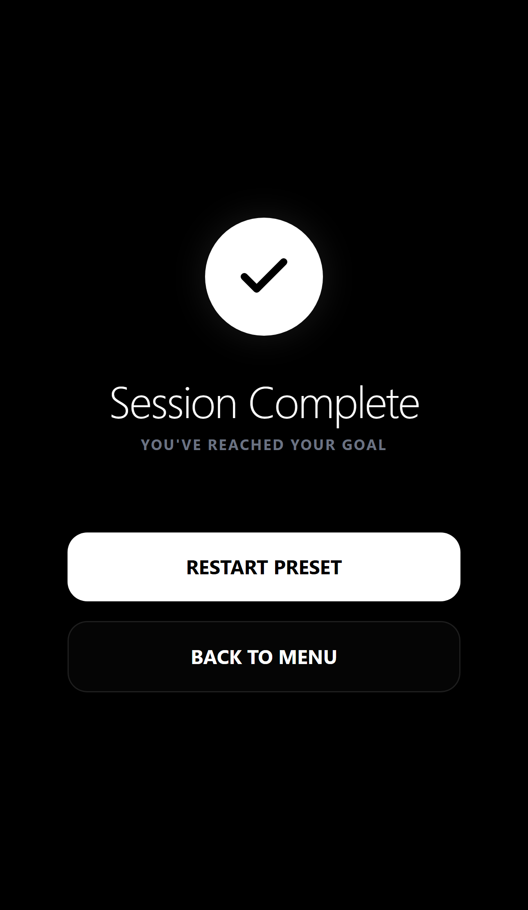

# Rep Counter ⚡

A minimalist, AMOLED-first Rep Counter PWA designed for peak performance and zero distractions. Built with **Svelte 5** and **Tailwind CSS v4**.


## 📱 Screenshots

<p align="center">
  
  
  
  
</p>

## ✨ Features

- **AMOLED-First Design:** Pure black background to save battery and look stunning on OLED screens.
- **Smart Persistence:** Never lose your progress. The timer and session state survive page refreshes and accidental closes.
- **PWA Ready:** Install it on your phone like a native app. Works offline and stays in your pocket.
- **Custom Routines:** Create, edit, and manage your own workout presets.
- **Seamless Flow:** 0-second rest support for high-intensity sessions with smooth visual transitions.
- **Haptic & Sound Feedback:** Get physical confirmation for every rep and set completed.
- **Privacy Focused:** No tracking, no ads, no cloud sync. Everything stays on your device.

## 🛠 Tech Stack

- **Framework:** Svelte 5 (using the latest Runes: `$state`, `$derived`, `$effect`)
- **Styling:** Tailwind CSS v4
- **State Management:** Svelte Stores with LocalStorage persistence
- **Build Tool:** Vite
- **Testing:** Vitest + Testing Library

## 🚀 Getting Started

### Prerequisites

- Node.js (v18 or higher)
- npm or pnpm

### Installation

1. Clone the repository:
   ```bash
   git clone https://github.com/Murqin/rep-counter.git
   cd rep-counter
   ```

2. Install dependencies:
   ```bash
   npm install
   ```

3. Start the development server:
   ```bash
   npm run dev
   ```

4. Build for production:
   ```bash
   npm run build
   ```

## 🧪 Testing

The project maintains a professional test suite located in the `/tests` directory.

```bash
npm test
```

## 📱 Mobile Layout

Designed specifically for mobile ergonomics. Features large hitboxes (min 44x44px), safe-area awareness for notches, and dynamic scaling for all screen sizes.

## ❤️ Support the Project

If you find this tool helpful, consider supporting its development:

[](https://buymeacoffee.com/murqin)

---

Made with ❤️ by [Murqin](https://github.com/Murqin)
