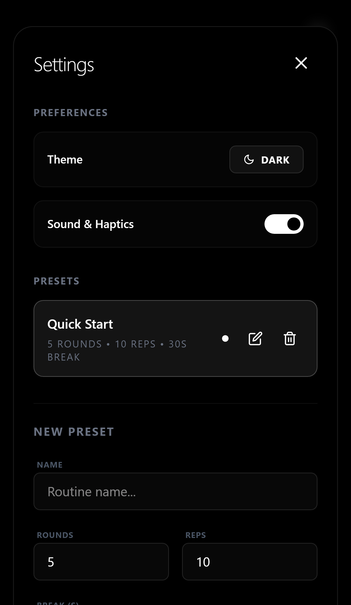
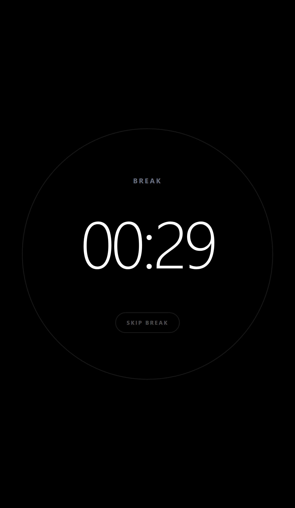
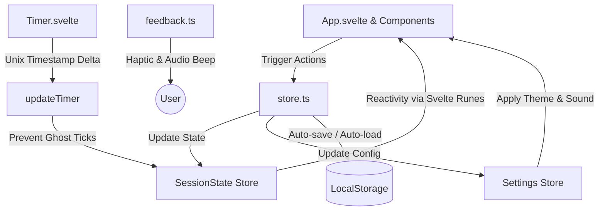

🌍 **Translations:** [English](README.md) | [Türkçe](README.tr.md)

---

# Rep Counter ⚡

A minimalist, AMOLED-first Rep Counter PWA designed for peak performance and zero distractions. Built with **Svelte 5** and **Tailwind CSS v4**.

<p align="center">
  <a href="https://svelte.dev">
    
  </a>
  <a href="https://tailwindcss.com">
    
  </a>
  <a href="https://www.typescriptlang.org">
    
  </a>
  <a href="https://rep-counter-sapphire.vercel.app/">
    
  </a>
</p>

⚡ **[Live Demo](https://rep-counter-sapphire.vercel.app/)**

---

## 📱 Screenshots

<p align="center">
  
  
  
  
</p>

---

## ✨ Features

- **AMOLED-First Design:** Pure black background (`#000000`) to save battery life on modern OLED screens while looking incredibly sleek.
- **Smart Persistence:** Never lose your workout. The timer and session state survive page refreshes and accidental browser closes by calculating delta timestamps (`lastTick`).
- **PWA Ready (Rich Install UI):** Installs as a standalone application on mobile and desktop. Includes high-quality app screenshots and description in the installation prompt.
- **Custom Routines:** Easily create, edit, and delete custom workout routines.
- **Seamless Flow:** 0-second rest support for high-intensity training with a 600ms transition pause to keep the visual pacing natural.
- **Haptic & Sound Feedback:** Short haptic taps for reps and rich audio feedback for completed sets. Fully toggleable in settings.
- **Privacy Focused:** No trackers, no ads, no cloud database. Everything is securely stored in your browser's local storage.

---

## 🏗 Architecture

The app uses Svelte 5 Runes combined with persistent writable stores to maintain an offline-first state structure:



---

## 🛠 Tech Stack

- **Framework:** Svelte 5 (utilizing Svelte runes: `$state`, `$derived`, `$effect`)
- **Styling:** Tailwind CSS v4 + Vanilla CSS Custom Variables for flexible theming
- **PWA Engine:** `vite-plugin-pwa` with custom Workbox caching strategy
- **Build Tool:** Vite
- **Testing Suite:** Vitest + Testing Library + JSDom

---

## 📲 PWA Installation Guide

### Mobile (Android & iOS)
- **Brave / Chrome (Android):** Open the site, tap the **"Install"** button. The browser will present a rich app store-like overlay with screenshots. Tap "Install" to add it to your launcher.
- **Firefox (Android):** Open the site, tap the `⋮` menu, and select **"Install"**.
- **Safari (iOS):** Open the site, tap the **Share** button, and select **"Add to Home Screen"**.
- *Note:* If you click add but the icon doesn't appear on Android, make sure the browser has the `"Add home screen shortcuts"` system permission enabled under your phone's App Info settings.

### Desktop (Windows, macOS, Linux)
- Open the site in any Chromium-based browser (Brave, Chrome, Edge), click the **Install icon** in the right-side of the address bar, and confirm the installation.

---

## 🚀 Getting Started

### Prerequisites
- Node.js (v18 or higher)
- npm or pnpm / yarn

### Installation
1. Clone the repository:
   ```bash
   git clone https://github.com/Murqin/rep-counter.git
   cd rep-counter
   ```

2. Install dependencies:
   ```bash
   npm install
   ```

3. Start development server:
   ```bash
   npm run dev
   ```

4. Build production bundle:
   ```bash
   npm run build
   ```

---

## 🧪 Testing

The project is protected by a solid unit and integration testing suite located in the `/tests` folder.

To run the Vitest suite:
```bash
npm test
```

To perform a Svelte type check:
```bash
npm run check
```

---

## ❤️ Support the Project

If you find this tool helpful, consider supporting its development:

[](https://buymeacoffee.com/murqin)

---

## 🔮 Future Roadmap

To keep this PWA robust, lightweight, and modern, the following features are planned for future releases:

1. **Workout History & Analytics:**
   - Persistent tracking of completed exercise sessions.
   - Elegant interactive progress charts, calendar heatmaps, and personal records tracking.

2. **Secure Data Backup & Sync:**
   - JSON format export/import of all custom presets, session history, and application settings to keep your data safe offline.

3. ~~**Alternative Timer Formats:**~~ **(Beta)**
   - ~~Support for EMOM (Every Minute on the Minute), Tabata, and AMRAP (As Many Rounds As Possible) training protocols.~~

4. **Customizable Voice Guide & Sounds:**
   - Multiple professional vocal cues and guide tones for rep milestones and transitions, fully toggleable in preferences.

---

Made with ❤️ by [Murqin](https://github.com/Murqin)
