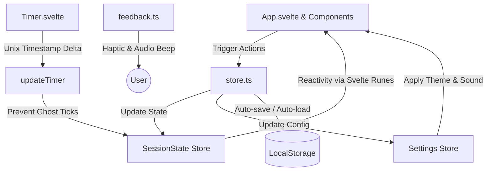

🌍 **Translations:** [English](README.md) | [Türkçe](README.tr.md)

---

# Rep Counter ⚡

> **A minimalist, AMOLED-first Rep Counter PWA designed for peak training focus and zero distractions. Built using Svelte 5 and Tailwind CSS v4.**

<p align="center">
  <a href="https://svelte.dev">
    
  </a>
  <a href="https://tailwindcss.com">
    
  </a>
  <a href="https://www.typescriptlang.org">
    
  </a>
  <a href="https://rep-counter-sapphire.vercel.app/">
    
  </a>
</p>

⚡ **[Live Demo Portal](https://rep-counter-sapphire.vercel.app/)**

---

## 📱 Screenshots

<p align="center">
  
  
  
  
</p>

---

## ✨ Features

- **🖤 AMOLED-First Layout:** Pure pitch-black background (`#000000`) designed to minimize battery drain on modern mobile OLED/AMOLED screens.
- **💾 Smart State Persistence:** Never lose active workout states. Session metrics and timers survive browser refreshes or closures by calculating precise delta timestamps (`lastTick`).
- **📱 PWA Ready (Rich Installation UI):** Installs as a native standalone application on iOS, Android, and Desktop. Includes app screenshots and descriptions inside the native prompt.
- **⚙️ Custom Workout Presets:** Instantly configure, save, edit, and delete custom exercise routine templates.
- **🔄 Zero-Second Rest Support:** Designed for high-intensity interval training (HIIT), featuring a fluid 600ms transition pause to keep UI pacing visual and natural.
- **🔊 Haptic & Audio Feedback:** Physical vibration feedback for registered reps and high-frequency sound alerts for set completions (fully toggleable).
- **🔒 Privacy Guaranteed:** Zero ads, zero background tracking, and no database synchronization. All session data resides exclusively inside your local browser storage.

---

## 🏗️ State Architecture

This PWA utilizes **Svelte 5 Runes** combined with persistent writable stores to maintain an offline-first state structure:



---

## 🛠️ Technology Stack

- **Framework Core:** Svelte 5 (leveraging Svelte runes: `$state`, `$derived`, `$effect`)
- **Styling Engine:** Tailwind CSS v4 + native CSS Custom Variables for flexible dark theming
- **PWA Service Worker:** `vite-plugin-pwa` utilizing an offline-first Workbox caching strategy
- **Bundler:** Vite
- **Testing Engine:** Vitest + Testing Library + JSDom

---

## 📲 PWA Installation Guide

### Mobile Environments (Android & iOS)
- **Brave / Chrome (Android):** Open the live link and tap the floating **"Install"** button. The browser will present a rich, card-style install prompt.
- **Firefox (Android):** Open the site, tap the `⋮` menu, and select **"Install"**.
- **Safari (iOS):** Open the site, tap the **Share** button, and select **"Add to Home Screen"**.
*(Note: If shortcuts fail to appear on Android, verify that your browser has the `Add home screen shortcuts` system permission enabled inside App Settings).*

### Desktop Environments
- Open the application portal inside any modern Chromium browser (Brave, Chrome, Edge), click the **Install icon** situated on the right side of the address bar, and confirm the installation prompt.

---

## 🚀 Local Development

### Prerequisites
- [Node.js](https://nodejs.org/) (Version 18 or higher)
- **Package Manager:** `npm` / `pnpm` / `yarn`

### Setup Steps
1. Clone the repository:
   ```bash
   git clone https://github.com/Murqin/rep-counter.git
   cd rep-counter
   ```
2. Install dependency registry:
   ```bash
   npm install
   ```
3. Boot the local development server:
   ```bash
   npm run dev
   ```
4. Compile production bundles:
   ```bash
   npm run build
   ```

---

## 🧪 Testing Registry

Rep Counter is verified via comprehensive unit and integration testing pipelines situated inside `/tests`:

Run the test suite:
```bash
npm test
```

Execute Svelte static type checking:
```bash
npm run check
```

---

## ❤️ Support the Developer

If you find this PWA useful, consider supporting its open-source maintenance:

[](https://buymeacoffee.com/murqin)

---

## 🔮 Roadmap

- **Workout History & Charts:** Persistent calendar tracking, heatmaps, personal records, and statistical trends.
- **Data Export & Import:** Export custom presets and history to lightweight JSON files to backup data offline.
- **Alternative Timer Protocols:** Support for EMOM (Every Minute on the Minute), Tabata, and AMRAP (As Many Rounds As Possible) routines.
- **Synthesized Vocal Guide:** High-quality synthesized speech guidance detailing reps and rest milestones.

---

Made with ❤️ by [Murqin](https://github.com/Murqin)
