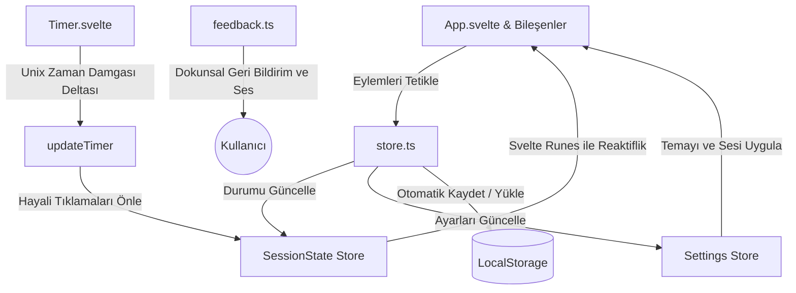

🌍 **Dil Seçenekleri:** [English](README.md) | [Türkçe](README.tr.md)

---

# Rep Counter ⚡

> **Maksimum antrenman odağı ve sıfır dikkat dağınıklığı için tasarlanmış, minimalist ve öncelikli AMOLED arayüzüne sahip Rep Sayacı PWA uygulaması. Svelte 5 ve Tailwind CSS v4 ile geliştirilmiştir.**

<p align="center">
  <a href="https://svelte.dev">
    
  </a>
  <a href="https://tailwindcss.com">
    
  </a>
  <a href="https://www.typescriptlang.org">
    
  </a>
  <a href="https://rep-counter-sapphire.vercel.app/">
    
  </a>
</p>

⚡ **[Canlı Demo Portalı](https://rep-counter-sapphire.vercel.app/)**

---

## 📱 Ekran Görüntüleri

<p align="center">
  
  
  
  
</p>

---

## ✨ Özellikler

- **🖤 Öncelikli AMOLED Tasarımı:** Modern mobil OLED/AMOLED ekranlarda pil tüketimini en aza indirmek ve son derece şık bir görünüm sunmak için tasarlanmış saf siyah arka plan (`#000000`).
- **💾 Akıllı Durum Koruma:** Antrenman verilerinizi asla kaybetmeyin. Sayfa yenilemelerinde veya tarayıcının kazara kapatılmasında, hassas delta zaman damgaları (`lastTick`) hesaplanarak oturum bilgileri ve zamanlayıcılar aynen korunur.
- **📱 PWA Desteği (Zengin Kurulum Arayüzü):** iOS, Android ve Masaüstü sistemlerde yerel bir uygulama gibi kurulabilir. Kurulum ekranında uygulama açıklamaları ve ekran görüntüleri yer alır.
- **⚙️ Özel Antrenman Şablonları:** Kendi egzersiz rutinlerinizi hızlıca oluşturun, kaydedin, düzenleyin ve silin.
- **🔄 Sıfır Saniye Dinlenme Desteği:** Yüksek yoğunluklu interval antrenmanları (HIIT) için tasarlanmıştır. Görsel akışın doğal kalması için geçişlerde akıcı bir 600 ms duraklama payı içerir.
- **🔊 Dokunsal Hissiyat ve Sesli Bildirimler:** Tamamlanan tekrarlar için kısa dokunsal titreşim geri bildirimi ve set bitişlerinde tiz sesli uyarılar (isteğe bağlı olarak kapatılabilir).
- **🔒 Gizlilik Garantisi:** Reklam yok, arka plan takibi yok, harici veri tabanı senkronizasyonu yok. Tüm antrenman verileriniz yalnızca tarayıcınızın yerel depolama alanında barındırılır.

---

## 🏗️ Durum Mimarisi

Bu PWA, çevrimdışı öncelikli bir durum yapısını sürdürmek için **Svelte 5 Runes** ve kalıcı yazılabilir mağazaları (stores) bir arada kullanır:



---

## 🛠️ Teknoloji Yığını

- **Çekirdek Çatı:** Svelte 5 (Svelte runeleri kullanarak: `$state`, `$derived`, `$effect`)
- **Stil Motoru:** Tailwind CSS v4 + esnek koyu tema geçişleri için yerel CSS Değişkenleri
- **PWA Servis İşçisi:** Çevrimdışı öncelikli Workbox önbelleğe alma stratejisini kullanan `vite-plugin-pwa`
- **Derleyici:** Vite
- **Test Motoru:** Vitest + Testing Library + JSDom

---

## 📲 PWA Kurulum Kılavuzu

### Mobil Cihazlar (Android & iOS)
- **Brave / Chrome (Android):** Sitedeki **"Yükle"** butonuna dokunun. Tarayıcınız, yerel bir uygulama mağazası tarzında zengin bir yükleme arayüzü sunacaktır.
- **Firefox (Android):** Siteyi açın, `⋮` menüsüne dokunun ve **"Yükle"** seçeneğini seçin.
- **Safari (iOS):** Siteyi açın, **Paylaş** butonuna dokunun ve **"Ana Ekrana Ekle"** seçeneğini seçin.
*(Not: Android'de kısayollar ana ekrana eklenemiyorsa, tarayıcınızın Uygulama Bilgileri ayarlarında "Ana ekrana kısayol ekle" sistem izninin açık olduğundan emin olun).*

### Masaüstü Sistemler
- Uygulamayı modern bir Chromium tabanlı tarayıcıda (Brave, Chrome, Edge) açın, adres çubuğunun sağ tarafındaki **Yükle simgesine** tıklayın ve kurulumu onaylayın.

---

## 🚀 Yerel Geliştirme

### Gereksinimler
- [Node.js](https://nodejs.org/) (Versiyon 18 veya üzeri)
- **Paket Yöneticisi:** `npm` / `pnpm` / `yarn`

### Kurulum Adımları
1. Depoyu klonlayın:
   ```bash
   git clone https://github.com/Murqin/rep-counter.git
   cd rep-counter
   ```
2. Bağımlılıkları yükleyin:
   ```bash
   npm install
   ```
3. Yerel geliştirme sunucusunu başlatın:
   ```bash
   npm run dev
   ```
4. Üretim sürümünü derleyin:
   ```bash
   npm run build
   ```

---

## 🧪 Testler

Rep Counter, `/tests` klasöründe yer alan kapsamlı birim ve entegrasyon testleri ile korunmaktadır:

Test paketini çalıştırın:
```bash
npm test
```

Svelte statik tip kontrolünü gerçekleştirin:
```bash
npm run check
```

---

## ❤️ Geliştiriciyi Destekleyin

Bu PWA uygulamasını faydalı bulduysanız, açık kaynaklı geliştirme sürecini desteklemeyi düşünebilirsiniz:

[](https://buymeacoffee.com/murqin)

---

## 🔮 Yol Haritası

- **Antrenman Geçmişi ve Grafikler:** Kalıcı takvim takibi, yoğunluk haritaları, kişisel rekorlar ve istatistiksel trendler.
- **Veri Aktarımı (İçe/Dışa Aktarma):** Özel antrenman şablonlarını ve geçmişinizi çevrimdışı yedeklemek için JSON formatında dışa aktarma.
- **Alternatif Zamanlayıcı Protokolleri:** EMOM (Every Minute on the Minute), Tabata ve AMRAP (As Many Rounds As Possible) rutinleri için destek.
- **Yapay Sesli Kılavuz:** Tekrarlar ve dinlenme süreleri hakkında sesli bildirimler ve rehber tonları.

---

[Murqin](https://github.com/Murqin) tarafından ❤️ ile yapılmıştır
