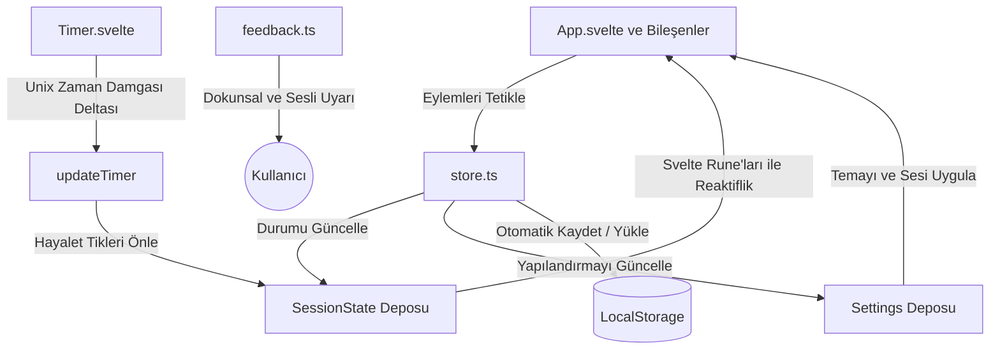

🌍 **Diller:** [English](README.md) | [Türkçe](README.tr.md)

---

# Rep Counter ⚡

Maksimum performans ve sıfır dikkat dağınıklığı için tasarlanmış minimalist, AMOLED öncelikli bir Tekrar Sayacı PWA. **Svelte 5** ve **Tailwind CSS v4** ile inşa edildi.

<p align="center">
  <a href="https://svelte.dev">
    
  </a>
  <a href="https://tailwindcss.com">
    
  </a>
  <a href="https://www.typescriptlang.org">
    
  </a>
  <a href="https://rep-counter-sapphire.vercel.app/">
    
  </a>
</p>

⚡ **[Canlı Demo](https://rep-counter-sapphire.vercel.app/)**

---

## 📱 Ekran Görüntüleri

<p align="center">
  
  
  
  
</p>

---

## ✨ Özellikler

- **AMOLED Öncelikli Tasarım:** Modern OLED ekranlarda pil ömründen tasarruf etmek ve son derece şık görünmek için saf siyah arka plan (`#000000`).
- **Akıllı Oturum Koruma:** Antrenmanınızı asla kaybetmeyin. Zamanlayıcı ve oturum durumu, delta zaman damgaları (`lastTick`) hesaplanarak sayfa yenilemelerinde ve tarayıcının yanlışlıkla kapatılmasında korunur.
- **PWA Desteği (Zengin Kurulum Arayüzü):** Mobil ve masaüstünde bağımsız bir uygulama olarak kurulabilir. Kurulum isteminde yüksek kaliteli uygulama ekran görüntüleri ve açıklamalar içerir.
- **Özel Programlar:** Kolayca özel antrenman programları oluşturun, düzenleyin ve silin.
- **Akıcı Geçişler:** Görsel tempoyu doğal tutmak amacıyla 600ms'lik bir geçiş duraklaması ile yüksek yoğunluklu antrenmanlar için 0 saniyelik mola desteği.
- **Dokunsal ve Sesli Geribildirim:** Tekrarlar için kısa dokunsal titreşimler ve tamamlanan setler için zengin sesli geribildirim. Ayarlardan tamamen kapatılabilir.
- **Gizlilik Odaklı:** Takipçi yok, reklam yok, bulut veritabanı yok. Her şey tarayıcınızın yerel depolama alanında (local storage) güvenli bir şekilde saklanır.

---

## 🏗 Mimari

Uygulama, çevrimdışı öncelikli bir durum yapısını korumak için Svelte 5 Rune'larını ve kalıcı yazılabilir mağazaları (persistent writable stores) birlikte kullanır:



---

## 🛠 Kullanılan Teknolojiler

- **Çatı (Framework):** Svelte 5 (Svelte rune'ları kullanılarak: `$state`, `$derived`, `$effect`)
- **Stil (Styling):** Tailwind CSS v4 + Esnek tema yönetimi için Saf CSS Özel Değişkenleri
- **PWA Motoru:** Özel Workbox önbelleğe alma stratejisiyle `vite-plugin-pwa`
- **Derleme Aracı (Build Tool):** Vite
- **Test Kütüphaneleri:** Vitest + Testing Library + JSDom

---

## 📲 PWA Kurulum Kılavuzu

### Mobil (Android ve iOS)
- **Brave / Chrome (Android):** Siteyi açın, **"Yükle"** butonuna dokunun. Tarayıcı, ekran görüntüleri içeren zengin bir uygulama mağazası benzeri arayüz sunacaktır. Başlatıcınıza eklemek için "Yükle" seçeneğine dokunun.
- **Firefox (Android):** Siteyi açın, `⋮` menüsüne dokunun ve **"Yükle"** seçeneğini seçin.
- **Safari (iOS):** Siteyi açın, **Paylaş** butonuna dokunun ve **"Ana Ekrana Ekle"** seçeneğini seçin.
- *Not:* Ekle seçeneğine tıklamanıza rağmen simge Android'de görünmüyorsa, tarayıcınızın telefonunuzun Uygulama Bilgisi ayarlarından `"Ana ekran kısayolları ekle"` sistem izninin etkinleştirildiğinden emin olun.

### Masaüstü (Windows, macOS, Linux)
- Siteyi herhangi bir Chromium tabanlı tarayıcıda (Brave, Chrome, Edge) açın, adres çubuğunun sağ tarafındaki **Yükleme simgesine** tıklayın ve kurulumu onaylayın.

---

## 🚀 Başlarken

### Gereksinimler
- Node.js (v18 veya daha yüksek)
- npm veya pnpm / yarn

### Kurulum
1. Depoyu klonlayın:
   ```bash
   git clone https://github.com/Murqin/rep-counter.git
   cd rep-counter
   ```

2. Bağımlılıkları yükleyin:
   ```bash
   npm install
   ```

3. Geliştirme sunucusunu başlatın:
   ```bash
   npm run dev
   ```

4. Yayına hazır sürümü derleyin:
   ```bash
   npm run build
   ```

---

## 🧪 Testler

Proje, `/tests` klasöründe yer alan güçlü bir birim ve entegrasyon test paketi ile korunmaktadır.

Vitest test paketini çalıştırmak için:
```bash
npm test
```

Svelte tip kontrolü (check) yapmak için:
```bash
npm run check
```

---

## ❤️ Projeyi Destekleyin

Bu aracı yararlı buluyorsanız, gelişimini desteklemeyi düşünebilirsiniz:

[](https://buymeacoffee.com/murqin)

---

## 🔮 Gelecek Yol Haritası

Bu PWA uygulamasını dayanıklı, hafif ve modern tutmak için gelecek sürümlerde aşağıdaki özelliklerin eklenmesi planlanmaktadır:

1. **Antrenman Geçmişi ve Analizler:**
   - Tamamlanan egzersiz seanslarının kalıcı takibi.
   - Şık, etkileşimli ilerleme grafikler, takvim ısı haritaları ve kişisel rekor takipleri.

2. **Güvenli Veri Yedekleme ve Senkronizasyon:**
   - Verilerinizi çevrimdışı güvende tutmak için tüm özel programların, seans geçmişinin ve uygulama ayarlarının JSON formatında dışa/içe aktarılması.

3. ~~**Alternatif Zamanlayıcı Formatları:**~~ **(Beta)**
   - ~~EMOM (Every Minute on the Minute), Tabata ve AMRAP (As Many Rounds As Possible) antrenman protokolleri desteği.~~

4. **Özelleştirilebilir Sesli Rehber ve Sesler:**
   - Tekrar dönüm noktaları ve geçişler için birden fazla profesyonel sesli ipucu ve rehber tonları, ayarlardan tamamen açılıp kapatılabilir.

---

[Murqin](https://github.com/Murqin) tarafından ❤️ ile yapılmıştır.
